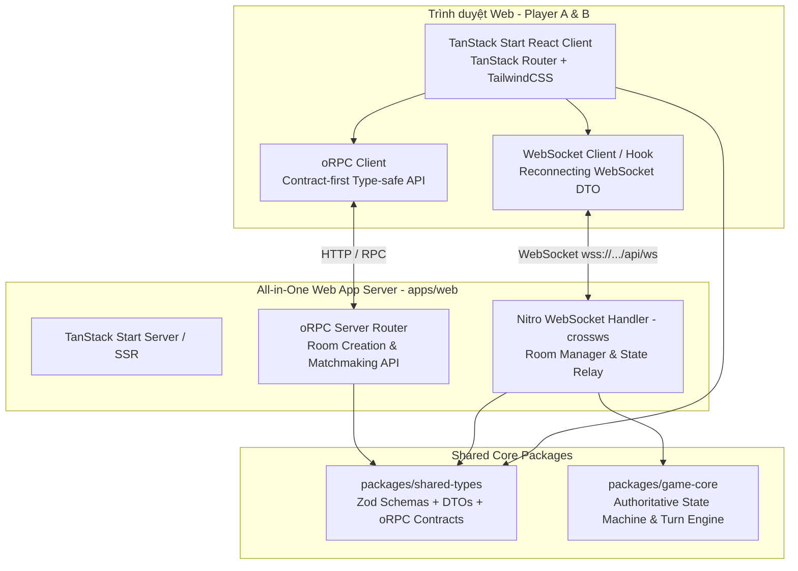
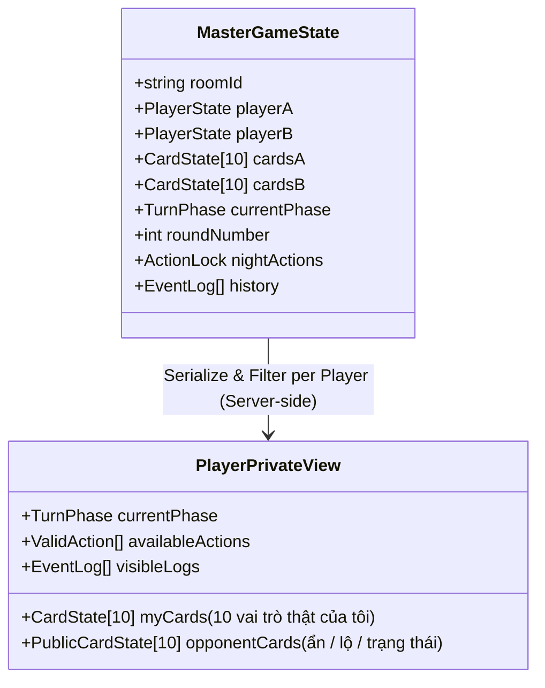
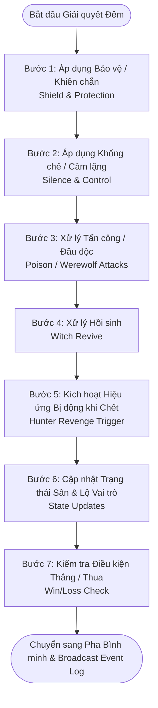

# Kế hoạch Phát triển Kỹ thuật (Technical Development Plan) — Twofold Web Alpha 2026

- **Phiên bản:** 1.1 (Đã chốt Tech Stack)
- **Ngày cập nhật:** 28/08/2026
- **Mục tiêu phát hành:** Web Alpha nội bộ trước 30/10/2026
- **Phạm vi áp dụng:** Toàn bộ Monorepo (`apps/web`, `packages/game-core`, `packages/shared-types`, `packages/cli`)

---

## 1. Tổng quan & Kiến trúc Hệ thống Đã Chốt

Dự án **Twofold** là game đối kháng chiến thuật 1v1 theo lượt với cơ chế thông tin ẩn lấy cảm hứng từ Ma Sói. Để tối ưu hóa tốc độ phát triển cho team nhỏ và đơn giản hóa quy trình triển khai (chỉ 1 dịch vụ web duy nhất), hệ thống áp dụng kiến trúc **All-in-One Fullstack App** với **TanStack Start + oRPC + Nitro Native WebSocket**.



### Nguyên tắc Kỹ thuật Cốt lõi
1. **Single Deployment (All-in-One):** Toàn bộ Frontend UI, RPC Endpoints và Realtime WebSocket Game Loop được gộp trong `apps/web` (chạy trên Nitro Server), chỉ cần deploy 1 container/service Node.js duy nhất.
2. **Contract-First Type-Safety (oRPC + Zod):** Mọi tương tác RPC và payload hành động đều được định nghĩa tại `packages/shared-types`, đảm bảo an toàn kiểu dữ liệu 100% từ Client tới Server.
3. **Deterministic & Headless Core (`packages/game-core`):** Game engine không phụ thuộc vào UI hay Network layer, 100% unit-testable với Vitest.
4. **Anti-Cheat by Design (State Isolation):** Server chỉ broadcast thông tin công khai (Public State) và thông tin riêng hợp lệ (Private State) cho từng client, tuyệt đối không gửi vai trò ẩn của đối thủ qua mạng.

---

## 2. Danh mục Workspace & Tech Stack

| Workspace / Module | Tech Stack Đã Chốt | Trách nhiệm chính |
|---|---|---|
| [`apps/web`](../../apps/web) | **TanStack Start + React 19 + TailwindCSS + Nitro WebSockets (`crossws`)** | Frontend Game Client (Bàn đấu, Animation, UI Panels) + All-in-One Backend Server (oRPC handlers + WebSocket Room Manager) |
| [`packages/shared-types`](../../packages/shared-types) | **TypeScript + Zod + oRPC Contracts** | Nguồn sự thật (Single Source of Truth) cho Schemas, DTOs, Enums, Contracts giữa Client và Server |
| [`packages/game-core`](../../packages/game-core) | **TypeScript Thuần (Zero runtime deps) + Vitest** | State Machine, Rule Validator, Night Resolution Engine, Hanging Calculator, Calamity Handler |
| [`packages/cli`](../../packages/cli) | **Node.js ESM thuần** | CLI quản lý monorepo (`pnpm tf`), build, test & scaffolding |
| [`apps/spec-reviewer`](../../apps/spec-reviewer) | **Vanilla JS, CSS Modules, JSON** | Công cụ tra cứu & thẩm định 92 vai trò của PO |

---

## 3. Cấu trúc Thư mục Kỹ thuật Chuẩn hóa

```text
twofold/
├── apps/
│   ├── web/                         # [ALL-IN-ONE FULLSTACK GAME APP]
│   │   ├── app/                     # TanStack Start Frontend
│   │   │   ├── routes/              # File-based routes (__root.tsx, index.tsx, room.$id.tsx, play.$id.tsx)
│   │   │   ├── components/          # UI Components (Board, Card, Slot, ActionPanel, EventLog, Dialogs)
│   │   │   ├── hooks/               # useGameSocket, useGameState, usePlayerActions
│   │   │   └── client.tsx           # Client entry
│   │   ├── server/                  # Backend in TanStack Start (Nitro Engine)
│   │   │   ├── rpc/                 # oRPC router implementations (createRoom, getRoomInfo)
│   │   │   └── ws/                  # Nitro WebSocket handler (crossws) + In-memory Room Store
│   │   ├── app.config.ts            # TanStack Start / Nitro config (bật websocket support)
│   │   └── package.json
│   └── spec-reviewer/               # Công cụ tra cứu 92 vai trò của PO
├── packages/
│   ├── shared-types/                # Shared Contracts & Schemas
│   │   ├── src/
│   │   │   ├── enums/               # CardRole, TurnPhase, Faction, ActionType
│   │   │   ├── schemas/             # Zod schemas cho Room, Player, Card, GameState
│   │   │   ├── contracts/           # oRPC contract definitions
│   │   │   └── events/              # WebSocket Client/Server DTOs
│   │   └── package.json
│   ├── game-core/                   # Headless Game Engine
│   │   ├── src/
│   │   │   ├── state/               # State machine, state transitions, state serializer
│   │   │   ├── resolution/          # Night Resolution Pipeline (Bảo vệ -> Tấn công -> Hồi sinh -> Trigger)
│   │   │   ├── actions/             # Handlers cho Dùng skill, Treo cổ, Bỏ lượt
│   │   │   ├── calamity/            # Calamity logic từ Vòng 7
│   │   │   └── index.ts             # Public API của Engine
│   │   ├── tests/                   # Vitest test suite (Deterministic & Conflict tests)
│   │   └── package.json
│   └── cli/                         # Monorepo CLI tool (tf / twofold)
├── docs/                            # Tài liệu dự án & ADRs
└── package.json
```

---

## 4. Thiết kế Luồng Dữ liệu & Bảo mật Thông tin (State Isolation)

Mỗi trận đấu có 3 góc nhìn trạng thái dữ liệu:



- **Player A View:** Thấy toàn bộ 10 vai trò của A. Đối với B, chỉ nhận ID lá bài, vị trí và trạng thái (`HIDDEN`, `REVEALED`, `PROTECTED`, `DEAD`).
- **Player B View:** Thấy toàn bộ 10 vai trò của B. Đối với A, chỉ nhận các thông tin công khai.
- **Hành động Đêm (Night Actions):** Client gửi action lên server dạng mã hóa/kín; Server chỉ broadcast kết quả sau khi pha Bình minh (Dawn) hoàn tất resolve.

---

## 5. Pipeline Giải quyết Kỹ năng Ban đêm (Night Resolution Engine)

Quy trình giải quyết ban đêm trong `packages/game-core` được chia theo các bước ưu tiên tuần tự để đảm bảo tính tất định (Deterministic):



### Bộ 10 Vai trò Alpha Skeleton:
1. **Dân làng (Villager x2):** Không có kỹ năng kích hoạt; mồi nhử và tham gia Treo cổ.
2. **Ma sói (Werewolf x2):** Ban đêm chọn 1 lá đối thủ để tấn công (gây chết nếu không được bảo vệ).
3. **Tiên tri (Seer x1):** Ban đêm soi 1 lá đối thủ (kết quả chỉ Tiên tri biết trong Private View).
4. **Bảo vệ (Bodyguard x1):** Ban đêm chọn 1 lá phe mình để nhận `PROTECTED` (chặn 1 nguồn sát thương đêm).
5. **Phù thủy (Witch x1):** Ban ngày hồi sinh 1 lá đồng minh đã chết; Ban đêm đầu độc 1 lá đối thủ. (Mỗi kỹ năng dùng 1 lần/trận).
6. **Thợ săn (Hunter x1):** Bị động: Khi bị loại, lập tức chọn 1 lá đối thủ kéo theo.
7. **Trưởng làng (Mayor x1):** Ban ngày: Có 1 lần Treo cổ sai mà không mất lượt của vòng đó.
8. **Kẻ ngụy trang (Disguiser x1):** Đổi vị trí hoặc che dấu vết trước Tiên tri.

---

## 6. Lộ trình Triển khai Kỹ thuật Chi tiết (Roadmap & Work Breakdown)

### Giai đoạn 1: Nền móng & Schemas (M1: 28/08 – 07/09/2026)
- [ ] **ST-01:** Khởi tạo `packages/shared-types` (Zod schemas, Enums, oRPC Contracts, WebSocket DTOs).
- [ ] **WEB-INIT:** Khởi tạo `apps/web` với TanStack Start, TailwindCSS, oRPC router và Nitro WebSocket handler.
- [ ] **GC-01:** Thiết lập khung State Machine trong `packages/game-core`.

### Giai đoạn 2: Game Core Engine & Test Matrix (M2: 08/09 – 14/09/2026)
- [ ] **GC-02:** Cài đặt toàn bộ Actions ban ngày (Dùng skill, Treo cổ đoán vai trò, Bỏ lượt).
- [ ] **GC-03:** Cài đặt Night Resolution Pipeline theo thứ tự ưu tiên.
- [ ] **TEST-01:** Viết bộ 50+ Unit Tests kiểm tra tính toàn vẹn trạng thái và edge-cases trên Vitest.

### Giai đoạn 3: Vertical Slice trên Web (M3: 15/09 – 21/09/2026)
- [ ] **WEB-01:** Dựng UI khung (Graybox) bàn cờ 10 vị trí bên mình và 10 vị trí đối thủ trên `apps/web`.
- [ ] **WEB-02:** Tích hợp Client với WebSocket Room Handler qua TanStack hooks.
- [ ] **WEB-03:** Thực hiện hoàn chỉnh 1 vòng lặp: Ban ngày $\rightarrow$ Ban đêm $\rightarrow$ Bình minh $\rightarrow$ Event Log hiển thị rõ ràng.

### Giai đoạn 4: Full Match Loop & Feature Freeze (M4: 22/09 – 05/10/2026)
- [ ] **WEB-04:** Màn hình Setup trước trận: Chọn/gán 10 vai trò cho 10 vị trí, Ready countdown 3s.
- [ ] **GC-04:** Cài đặt hệ thống **Tai họa (Calamity)** tự động kích hoạt từ Vòng 7.
- [ ] **NET-01:** Xử lý Reconnect Window (20–60s) khi mất mạng/F5 và phát hiện đối thủ rời phòng.
- [ ] **WEB-05:** Màn hình Kết quả, Thắng/Thua, Đấu lại (Rematch) và Thoát phòng.
- [ ] **MILESTONE:** **Feature Freeze vào ngày 05/10/2026**.

### Giai đoạn 5: Internal Alpha Playtest & Polish (M5: 06/10 – 19/10/2026)
- [ ] Tổ chức ít nhất 10 session playtest nội bộ ghi hình và log dữ liệu.
- [ ] Tinh chỉnh UI/UX: Animation lật bài, hiệu ứng ngày/đêm, âm thanh.
- [ ] Sửa lỗi desync và tối ưu hóa độ trễ (latency).

### Giai đoạn 6: Triển khai & Phát hành Web Alpha (M6: 20/10 – 30/10/2026)
- [ ] Deploy bản production container/server lên Fly.io / Render / VPS.
- [ ] Smoke test đa trình duyệt (Chrome, Safari, Firefox, Edge).
- [ ] Bàn giao bản Web Alpha và mở kênh thu thập phản hồi.

---

## 7. Quyết định Kỹ thuật (ADR Links)

- [ADR-0001: Core rules cho prototype v0.1](../decisions/0001-core-rules-v0.1.md)
- [ADR-0002: Phạm vi và milestone Web Alpha](../decisions/0002-alpha-scope-and-milestones.md)
- [ADR-0003: Kiến trúc TanStack Start, oRPC và All-in-One WebSocket](../decisions/0003-tech-stack-tanstack-start-orpc.md)
